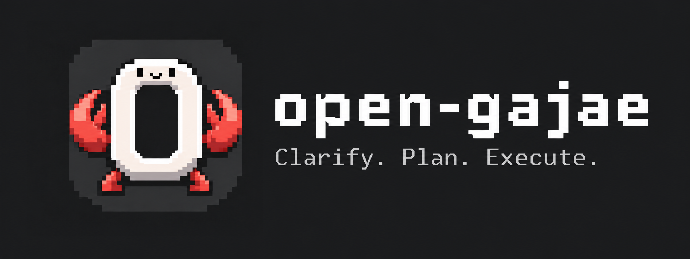

[English](README.md) | [한국어](README.ko.md)



# open-gajae

**A personal learning and toy project built as a plugin for OpenCode v2.** OpenCode v1 is not supported.

## Background and project status

I enjoyed using [gajae-code](https://github.com/Yeachan-Heo/gajae-code) and [oh-my-claudecode (OMC)](https://github.com/Yeachan-Heo/oh-my-claudecode), and wanted a similar experience in an environment where I could only use OpenCode. I started open-gajae to explore that possibility and learn how to develop coding agents, drawing on both projects as references. I also studied [oh-my-openagent (OMO)](https://github.com/code-yeongyu/oh-my-openagent) as a reference for OpenCode plugin development and host integration. Many thanks to the authors and contributors of all three projects for the inspiration and work shared with the community.

This is an independent, unofficial project. It is not affiliated with or endorsed by gajae-code, OMC, OMO, or OpenCode/Anomaly, and is not an official port or compatibility layer for gajae-code, OMC, or OMO. It does not guarantee the same features, behavior, or compatibility as those projects. Its purpose is personal learning and experimentation.

For retained and adapted third-party material, see [third-party notices](THIRD-PARTY-NOTICES.md). [Banner credits](assets/branding/open-gajae-banner.md).

## License

Original open-gajae contributions are licensed under MIT; third-party material remains under its respective original license. See [LICENSE](LICENSE) and [THIRD-PARTY-NOTICES](THIRD-PARTY-NOTICES.md) for the applicable terms.

## Overview

An OpenCode plugin with session-bound `deep-interview`, `ralplan`, and `ultragoal` skills, eight owned roles, and a small read-only code-research surface. It adapts selected OMC v5.4.0 material; it is **not** a full OMC port; its one execution workflow is `ultragoal`, the port of OMC ralph.

## Scope and status

- The baseline is OMC v5.4.0, commit `5281b19e0d64f8e6dc6767f2130299a88af2dc71`.
- The target host is OpenCode v2. This port targets `@opencode/plugin` 2.0.15 against the local `opencode/` reference pinned to `v2.0.15` (`6f3639d82e`); a v1 host can no longer load this plugin (v1 support is dropped — see the deviations table).
- The package is TS source with no build step: `package.json` `exports["."]` points at `./src/index.ts`, and the root `index.ts` re-exports it. There is no `dist/`.
- Implemented scope: `deep-interview`, `ralplan`, and `ultragoal`; `open-gajae`, `open-gajae-explore`, and `open-gajae-document-specialist`; the `open-gajae-planner`, `open-gajae-architect`, and `open-gajae-critic` consensus roles; the `open-gajae-executor` and `open-gajae-cleaner` ultragoal-execution roles; session state; native document output; and twelve directly-callable tools (three state tools, the `ultragoal` tool, and eight read-only AST/LSP tools). Company context (the v1 advisory MCP hook) is removed entirely.
- `ralplan` is implemented and ends at a plan marked `pending approval`, whose final approval step offers `Refine further`, `Execute via ultragoal`, or `Stop here`. `ultragoal` is implemented as a goal-driven persistence loop (a port of OMC's ralph) with per-goal architect verification, a mandatory read-only cleaner pass, and a final critic review; the deep-interview → ralplan → ultragoal handoff chain is provided. Not provided: autopilot, team, a standalone `ralph` skill, autoresearch, shared session state, or automatic migration/recovery. No slash commands exist; entry is a skill mention or a keyword (see Entry, below).
- This documentation describes the implemented v2 contract on `feat/opencode-v2-port` as of commit `f4df6e6`. It does not establish Phase 1 completion, and it does not itself assert that the verification layers below (typecheck, unit tests, host probes) currently pass — see the plan and its ledger for that.

See [AGENTS.md](AGENTS.md) for development policy and [third-party notices](THIRD-PARTY-NOTICES.md) for attribution.

## Install (OpenCode v2)

```sh
bun install
bun run typecheck
bun test
```

Add a `plugins` entry pointing at this repository's **directory** (not a built file) to the host config, typically `~/.config/opencode/opencode.jsonc`:

```jsonc
{
  "plugins": ["/Users/dongwuk/apps/open-gajae"],
  "default_agent": "open-gajae",
  "experimental": { "subagent_depth": 2 }
}
```

- `plugins` must be a directory path. The v2 host resolves `<dir>/server`, then `<dir>/index`, with extension inference, and skips a configured plugin path that is a file — even though some host docs show file-path examples (a recorded docs/implementation mismatch). This package's root `index.ts` re-exports `./src/index.ts`, so the host loads TypeScript source directly with no build step.
- `experimental.subagent_depth: 2` is required for the `open-gajae-planner` role to delegate research to `open-gajae-explore`/`open-gajae-document-specialist` through the native `subagent` tool. The plugin cannot set this itself — v2's plugin API has no config-mutation domain, unlike v1 — so it is a host setting you add yourself. Without it, the planner's prompt falls back to direct `read`/`grep`/`glob` research and notes the fallback in the plan.
- `default_agent: "open-gajae"` makes the primary role the default for new sessions. Optional but recommended.
- This is not a full replacement config; keep the rest of the file and add only these keys. The plugin never edits host configuration.

This is a summary; see [`docs/local-install-v2.md`](docs/local-install-v2.md) for a full step-by-step walkthrough with a verification checklist, and [`docs/local-install-v1.md`](docs/local-install-v1.md) for the superseded v1 setup this replaces (kept as history).

Once a first prompt has been sent in this directory (plugin `setup` runs lazily, on the first prompt in a location, not at server start), inspect the installed surface with `GET /api/plugin` (confirms the plugin id and its `index.ts` source path) or `opencode debug agent <id>` / `opencode debug skill`.

## Entry

No slash commands exist in this port; v1's `/deep-interview` and `/ralplan` are gone (a recorded deviation). Enter a skill two ways:

- **Mention:** type `@deep-interview` or `@ralplan` and pick it from the TUI's autocomplete. Selecting it attaches the skill directly; typing the text without selecting the suggestion sends plain text with no attached skill, since the server does not parse `@` mentions itself — the keyword path below is what picks that up instead.
- **Keyword:** the same OMC-derived keyword detection as v1 (English/Korean/Japanese forms, exclusion of questions/quotes/code blocks, and ralplan's invocation-context requirement) enters the skill from plain text and injects a notice.

## Deep interview and storage

A `@deep-interview` mention or one of the keywords `deep interview`, `deep-interview`, `딥인터뷰`, `ディープインタビュー`, `ouroboros` starts requirements clarification. As in OMC, only informational contexts are excluded (questions, quoted or referenced mentions, and text inside code, tables, or block quotes), and a message that starts with the `ouroboros`/`ooo` CLI form is ignored. A turn carrying the keyword, or an explicit `@deep-interview` mention, injects OMC's `[MAGIC KEYWORD: DEEP-INTERVIEW]` guide at most once and seeds no state — an explicit mention now getting the same notice as a bare keyword is OMC parity; v1 suppressed the notice on explicit invocation (a recorded deviation). The skill uses native `question` one question at a time. A denied or unavailable question tool is reported; prose fallback does not substitute for it. A completed spec is not authorization to implement it.

After reaching the ambiguity threshold and saving the spec, the skill asks whether to finish or refine further. Refinement preserves the current session and history, asks an additional requirements question before rechecking the threshold, and updates the same spec file. The choice itself does not consume a round. The cumulative `maxRounds`, explicit early exit, and cancellation still apply; tool failures are never treated as consent to finish. Choosing "Refine with ralplan consensus" saves the spec, then invokes the `ralplan` skill with the saved spec path (`{specsDir}/deep-interview-{slug}.md`) as context, using OMC-style wording that names the skill by content rather than its input field — the v2 `skill` tool's input is `{ id }` only, and naming the wrong field risks one host input-error retry before the model corrects itself. This is a prompt-level interaction contract, not a host-enforced state machine.

State tools are `state_read`, `state_write`, and `state_clear`. They use the trusted current `ToolContext.sessionID`; callers cannot select another session. Each session owns one directory named `_session-<YYYYMMDD-HHMMSS>-<session id>`, where the label is the session's creation time in local time and the ID is the native session ID verbatim (for example `_session-20260918-030958-ses_f4f8651eaffeQnjyo1jEd5zVDu`). The creation time is read once from the host when the directory is first resolved; afterwards the directory is found by its session-ID suffix, and two directories with the same suffix are an error. Generated paths are:

```text
<worktree>/.open-gajae/
  _session-<created>-<session-id>/
    state/deep-interview-state.json
    specs/deep-interview-<slug>.md
    plans/<slug>.md
```

State writes replace the model snapshot; explicit tool fields win and `_meta` is regenerated. `state_clear` deletes only the current session's state JSON. It preserves session documents, other sessions, and legacy files. Invalid/corrupt state is surfaced and preserved rather than reset.

State operations for the same canonical file are serialized inside one plugin process and publish JSON with temporary-file rename. This is not IPC locking, a transaction across state and document saves, power-loss durability, or multi-process safety. Specs are saved outside that queue using native `write`. Further interview results update the same file, with no suffix, receipt, index, or automatic recovery.

A user may explicitly name another session's spec or plan as an input. Native Read and its normal permissions apply. The current session must report the path actually read; it must not scan for a latest document or substitute another file. Reading A from B transfers no state, owner, approval, or checkbox and does not authorize source edits or plan execution. B writes only its own state/documents.

## Ralplan

A `@ralplan [--interactive] [--deliberate] <task>` mention, or the `ralplan`/`랄플랜` keyword, starts consensus planning. As in OMC, the keyword only activates in an invocation context: a direct prefix (`$ralplan`, `!ralplan`, `force: ralplan`), an activation verb (`use`, `run`, `start`, `please`, `let's`), or the keyword at the start of the message. Questions, quoted or referenced mentions, and text inside code, tables, or block quotes do not activate it. The keyword works from any primary agent; messages whose agent is `open-gajae-planner`, `open-gajae-architect`, or `open-gajae-critic` are ignored by the keyword hook. When one message carries both the ralplan and the deep-interview keywords, both notices are injected, ralplan first, and only ralplan state is seeded.

A keyword turn seeds `awaiting_confirmation: true` and injects a `[MODE: RALPLAN]` notice asking the model to load the `ralplan` skill. A `@ralplan` mention seeds the state already confirmed (`awaiting_confirmation: false`), since the host has already attached the skill for that turn, and injects its own `[MODE: RALPLAN]` notice saying the skill is attached, so the insertion is visible (the TUI shows `open-gajae: ralplan mention notice added`). The host's own `skill` tool call with `id: "ralplan"` also clears `awaiting_confirmation`, the same way OMC clears it on an observed skill load. A stale, unconfirmed seed is cleared by the next user message that carries no ralplan keyword or mention.

Notices — the ralplan notice, the deep-interview magic guide, the restore banner, and the breaker message — are written as `ctx.session.synthetic({ resume: false })` messages, after the state write that seeded or updated them. The host places a synthetic message **before** the user's message in the same turn, unlike OMC/v1, which appended it after (a recorded host-placement deviation, not a design choice). If `synthetic` itself fails, the notice is appended, marker-wrapped, to the prompt text instead, so it is never silently lost; the state write is kept either way.

Three native `question` prompts are always on: an intent check after the Planner draft, a post-consensus check, and a final approval question offering `Refine further` and `Stop here`. `--interactive` adds only the draft review. `--deliberate` adds a pre-mortem and an expanded test plan, and it auto-enables on explicit high-risk signals. No continuation fires while a question is open, because the native `question` tool holds execution until it is answered — no `session.execution.succeeded` is published in the meantime.

Session artifacts extend the existing session contract:

```text
<worktree>/.open-gajae/
  _session-<created>-<session-id>/
    plans/<slug>.md
    drafts/<slug>.md
    state/ralplan-state.json
```

State tools accept `mode: "deep-interview" | "ralplan"`. The default is `deep-interview`, so existing deep-interview behavior is unchanged.

Continuation re-prompts the session on the durable `session.execution.succeeded` event (v2 does not publish `session.idle`) via `ctx.session.synthetic({ resume: true })`, while ralplan state is active. A circuit breaker stops reinforcement after 30 injections, and the breaker counter expires after 45 minutes, unchanged from v1's constants. When the user interrupts a turn — `session.execution.interrupted` with reason `user` (Esc, or the interrupt API) or `shutdown` (a dismissed `question` form, and the host's default reason-less interrupt) — a stop mark is set; only the next real user prompt clears it. Reasons `inactivity` and `superseded` do not set the mark. Continuation also skips while an owned background subagent session (launched with `background: true`) is still running under the current session, tracked from `session.created`/`session.execution.started`/terminal events by `parentID` (OMC/OMO parity; v1 had no background-subagent case). When such a child finishes, the host's own subagent-completion synthetic resumes the parent, and that later `succeeded` is judged like any other, bounded by the same breaker. Because a v2 plugin instance is created per location on a shared server and every instance receives every server event, this plugin only acts on sessions whose location matches its own — a fact new to v2, not a change to any of the decisions above.

`[RALPLAN MODE RESTORED]` appears at most once per resume and only within the same session. State is per-session; there is no cross-session resume.

The plan stays `pending approval` unless the user chooses **Execute via ultragoal**.

The real handoff: on **Execute via ultragoal**, ralplan marks the plan `approved`, calls `state_write(mode="ralplan", active=false, current_phase="handoff", plan_path="<absolute plan path>")` instead of `state_clear`, then loads the `ultragoal` skill and calls `create` with `source_plan` set to the plan path (or `resume` when an unfinished goal list already exists). The reverse also exists: `ultragoal handoff(to="ralplan", reason)` pauses the run — goals and progress are kept, not deleted — and re-seeds ralplan state; choosing `Execute via ultragoal` again later calls `resume` and merges the new plan into the kept goals with `add`, `revise`, and `supersede`.

## Owned roles and settings

- **`open-gajae`** is the primary. It owns edits, decisions, integration, and state write/clear. No rules are added beyond the host defaults.
- **`open-gajae-explore`** investigates repository facts read-only. It cannot edit, delegate (`subagent`), ask questions (`question`), or write/clear state. It keeps full `shell` access (OMC parity — no `shell`/Bash rule is added for any role).
- **`open-gajae-document-specialist`** researches documentation and citations. It cannot edit, delegate, ask questions, or write/clear state. Its `chub` protocol is documented as read-only in its prompt; the host permission rules do not restrict `shell` to only `chub` commands.
- **`open-gajae-planner`**, **`open-gajae-architect`**, and **`open-gajae-critic`** are the ralplan consensus roles. All three run as `mode: subagent` and carry no default model; set one through the settings `agents` map. Architect and critic are read-only: `edit` and `subagent` are denied, as are `question`, `state_write`, and `state_clear`. The planner, as in OMC, saves plans itself and delegates research: its `edit` permission allows only `.open-gajae/_session-*/plans/*` and `.open-gajae/_session-*/drafts/*`, and an `execute.before` guard (via `ctx.tool.hook`) further restricts those writes to the current root session's own directory — it invalidates a call outside that scope so the host's own decode fails, then `execute.after` rewrites that error (and any denial the static `edit` rules themselves produced) into model-facing guidance. Its `subagent` permission allows only `open-gajae-explore` and `open-gajae-document-specialist`. `question`, `state_write`, `state_clear`, and both Code Mode session tools (`opencode_session_move`, `opencode_session_rename`) stay denied for all seven subagent roles. `subagent_depth` is not raised by the plugin; set `experimental.subagent_depth: 2` in host config yourself (see Install).
- **`open-gajae-executor`** (ported from OMC's `agents/executor.md`) implements the code changes for one `ultragoal` goal at a time. It cannot ask questions (`question` denied) and cannot use the `ultragoal` tool itself; its only delegation is `subagent` to `open-gajae-explore` for codebase lookups and `open-gajae-architect` after repeated failures on the same issue. It keeps `edit` and `shell`.
- **`open-gajae-cleaner`** (ported from OMC's `ai-slop-cleaner` skill, reworked as a read-only reviewer) is `ultragoal`'s mandatory cleanup review, run once every goal is verified and before the final critic review. It cannot edit, write, patch, delegate, ask questions, write/clear state, or use the `ultragoal` tool; it keeps `shell` for inspection and reports `BLOCKING`/`NON-BLOCKING` findings by file and line without changing anything.
- Within `ultragoal`, `open-gajae-architect` and `open-gajae-critic` additionally keep the `ultragoal` tool, restricted to `status`; they return their verdict in their response and the primary records it with `record_verdict` (as gajae-code's leader-recorded review). Every other owned role has `ultragoal` denied.

Role rules are pushed onto each agent's `permissions` array after the host's own defaults, but **host `agents.<id>` permission rules from your config apply after the plugin's and win** — unlike v1, which reordered rules to keep a mandatory denial in force, a host override can loosen a role's default deny (a recorded deviation: "user config wins"). Settings are read from `~/.open-gajae/open-gajae.jsonc` and `<worktree>/.open-gajae/open-gajae.jsonc`. Fields merge project → user → defaults; unknown keys, invalid JSONC, or invalid values fail with diagnostics.

```jsonc
{
  "deepInterview": { "ambiguityThreshold": 0.2, "maxRounds": 20 },
  "ultragoal": {
    // 0 = unlimited, default 200
    "hardMaxIterations": 200
  },
  "agents": {
    "open-gajae": { "model": "provider/model", "variant": "variant-name" },
    "open-gajae-planner": { "model": "openai/gpt-6-luna" },
    "open-gajae-architect": { "model": "openai/gpt-6-luna", "variant": "high" },
    "open-gajae-critic": { "model": "openai/gpt-6-luna", "variant": "high" },
    "open-gajae-executor": { "model": "openai/gpt-6-luna", "variant": "medium" },
    "open-gajae-cleaner": { "model": "openai/gpt-6-luna", "variant": "medium" }
  }
}
```

`ultragoal.hardMaxIterations` is an integer `>= 0`; `0` means unlimited and the default is `200` (a hard ceiling on continuation iterations: when `max_iterations` has been extended up to it, the loop stops and reports; independent of the per-goal and final reviews below).

`variant` requires `model` on the same, already-merged entry: a user-level `model` plus a project-level `variant` is valid, but `variant` alone — in one file or split across both with no `model` anywhere — is rejected with an error naming the agent and asking to add `model "provider/model"`. This is stricter than the v2 host itself, which silently drops such a variant with a diagnostic. There is no provider fallback, tier mapping, or artificial collision rejection. The v1 `companyContext` setting is gone; supplying it now fails as `unknown setting`.

`ultragoal` layers its verification instead of trusting a single completion claim. Each goal is checked against its own acceptance criteria by a fresh `open-gajae-architect` session, whose `approve` or `reject` verdict the primary records with `record_verdict`; once every goal is verified, a mandatory read-only `open-gajae-cleaner` pass reviews the run's changed files and any blocking finding is fixed before continuing; and only after that cleanup and a passing regression re-run does a fresh `open-gajae-critic` session review the whole run; the primary records its final verdict. The loop only completes on that final critic approval — a rejection at any layer reopens the goal(s) it names instead of ending the run. `ultragoal cancel(reason)` abandons the run (its state is removed, but `goals.json`/`progress.txt` are kept for a later `resume`), and `ultragoal.hardMaxIterations` is the hard ceiling behind all of it.

## Read-only code tools

The plugin registers eight read-only code tools (plus the three state tools and the `ultragoal` tool above, twelve in total):

- `ast_grep_search` (`@ast-grep/napi` 0.31.1): AST search only; no replace.
- `lsp_goto_definition`, `lsp_hover`, `lsp_diagnostics`, `lsp_find_references`, `lsp_document_symbols`, `lsp_workspace_symbols`, and `lsp_servers`.

LSP servers are detected and reported, never downloaded. There is no LSP rename, code-action, or replacement suite. The actor set is all eight owned roles — `open-gajae`, `open-gajae-explore`, `open-gajae-document-specialist`, `open-gajae-planner`, `open-gajae-architect`, `open-gajae-critic`, `open-gajae-executor`, and `open-gajae-cleaner` — matching OMC, where every agent can use the read-only LSP/AST tools. The project boundary replaces v1's per-call host permission ask: an input path is resolved against the host's current location directory, symlinks are followed, and the real target must stay inside the real project directory; `.env` and `.env.*` files are refused by both the requested and the resolved name, and `ast_grep_search` skips them during traversal too. Neither tool expands the explorer's permissions or grants arbitrary shell execution.

The only product environment knobs reached by source are `OPEN_GAJAE_LSP_TIMEOUT_MS`, `OPEN_GAJAE_LSP_IDLE_TIMEOUT_MS`, `OPEN_GAJAE_LSP_IDLE_CHECK_INTERVAL_MS`, `OPEN_GAJAE_LSP_CONTAINER_ID`, and `OPEN_GAJAE_PYTHON_LSP=basedpyright`. They are LSP implementation settings, not general configuration.

## Deviations from OMC and the v1 plugin

Every host-required change from the OMC contract, or from the v1 implementation this replaces, is listed here (AGENTS.md policy). None of these were made unilaterally; each traces to a decision in the port's spec/plan (`.omc/specs/deep-interview-opencode-v2-port.md`, `.omc/plans/ralplan-opencode-v2-port.md`).

| Deviation | Detail |
|---|---|
| No slash commands | v1's `/deep-interview` and `/ralplan` are gone. Entry is only a skill mention or a plain-text keyword. |
| Company context removed | The `companyContext` setting, the runtime-settings block entry, the deep-interview/ralplan step-0 instructions, and `tests/company-context-probe.ts` are gone entirely, not merely undocumented. |
| `subagent_depth` is a host setting | v2's plugin API has no config-mutation domain, so the plugin cannot raise it as v1 did. Set `experimental.subagent_depth: 2` yourself; the planner falls back to direct research when refused. |
| User config wins over role rules | Host `agents.<id>` permission rules apply after the plugin's and can loosen a role's default deny, unlike v1's rule-reordering trick. |
| Explore and document-specialist keep full shell access | OMC parity: no `shell`/Bash permission rule is added for any role. |
| "Bash" renamed to `shell` | Every prompt and skill uses the v2 tool name `shell` instead of "Bash". |
| The deep-interview → ralplan bridge names the skill, not the input field | OMC-style wording ("invoke the `ralplan` skill … as context"); the v2 `skill` tool's input is `{ id }` only, and a wrong first guess costs one host input-error retry. |
| Notices fall back to appended prompt text only on failure | Notices are `synthetic` messages, state-first; if `synthetic` itself rejects, the (marker-wrapped) notice is appended to the prompt text instead of being lost. |
| Notices land before the user's message | The host places a `synthetic` notice before the user message in the same turn; OMC/v1 appended it after. A host placement fact, not a design choice. |
| TUI line for inserted messages | The TUI hides a `synthetic` message that has no `description`. Every notice and continuation the plugin inserts carries a one-line description (for example `open-gajae: ralplan keyword notice added`, `open-gajae: ralplan continuation 1/30`) so the user sees each insertion; the full text reaches only the model, as in OMC. |
| TS-source packaging, no build step | Root `index.ts` and `package.json` `exports["."]` point at `./src/index.ts`. `dist/` and the build script are gone. |
| `variant` without `model` is a settings error | Rejected after the user+project merge, with a message naming the agent — stricter than the v2 host, which just drops the variant with a diagnostic. |
| Continuation runs on durable execution events | `session.execution.succeeded` replaces `session.idle`, which v2 does not publish. |
| Continuation waits on background subagents | Skipped while an owned `background: true` child session is still running, tracked via `parentID` and execution events (OMC/OMO parity; v1 had no equivalent). |
| Interrupt handling is reason-based | `user` and `shutdown` set a stop mark cleared only by the next real prompt; `inactivity`/`superseded` do not; a host-triggered resume after a background child completes is judged like any other `succeeded`, bounded by the breaker. |
| Per-location event filtering | A v2 plugin instance is created per location, but a shared server delivers every event to every instance; this plugin acts only on sessions whose location matches its own. New to v2, not an R-decision change. |
| The artifact guard blocks by input invalidation, not a throw | `execute.before` replaces a blocked call's input with `{}` so the host's own decode fails; `execute.after` then rewrites that error (and any planner permission-scope denial) into model-facing guidance. A Promise-hook throw would surface as a host defect instead. |
| The code-tool boundary is realpath containment, not a host ask | Resolves against the host's current location, follows symlinks, requires containment in the real project directory, and excludes `.env`/`.env.*`, replacing v1's per-call permission `ask`. |
| The LSP surface grew from four tools to seven | `lsp_goto_definition`, `lsp_hover`, and `lsp_diagnostics` were added to `lsp_find_references`, `lsp_document_symbols`, `lsp_workspace_symbols`, and `lsp_servers`. |
| `@deep-interview` mentions get the magic notice too | OMC parity; v1 suppressed the notice on an explicit invocation. |
| `@ralplan` mentions get a notice too | The mention notice states that the skill is already attached. OMC notices an explicit invocation as well; the wording is a host addition. Added so users see every insertion. |
| Install docs show only the directory plugin form | Some host docs show a file-path `plugins` example, but the v2 host actually skips a configured plugin path that is a file. |

## Validation evidence and limits

The verification layers this port defines are: `bun run typecheck` and `bun test` on `@opencode/plugin` 2.0.15; unit tests for the prompt hook, permission-rule generation, continuation, the artifact guard, and the state/code tools; host probes against a local OpenCode 2.0.15 binary (`tests/host-probe.ts`, `tests/host-session-probe.ts`, `tests/planner-permission-probe.ts`, `tests/package-probe.ts`); and a manual checklist with `openai/gpt-6-luna` covering the deep-interview → ralplan bridge, keyword entry, an Esc interrupt during ralplan, and planner delegation with and without `experimental.subagent_depth`. Their current pass/fail status is tracked by the port's plan and ledger, not asserted by this document.

These layers are transport and source-contract checks, not proof of LLM obedience, prompt-branch guarantees, injection resistance, semantic model quality, external credentials, or installed language-server semantic correctness. LSP servers are never downloaded automatically. This guide records behavior and evidence scope; independent completion proof belongs in the durable delivery ledger.
